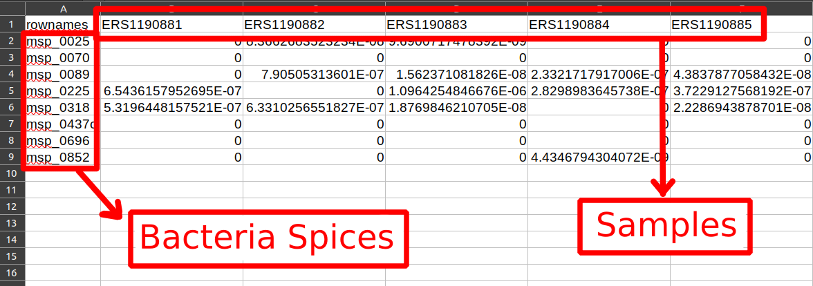
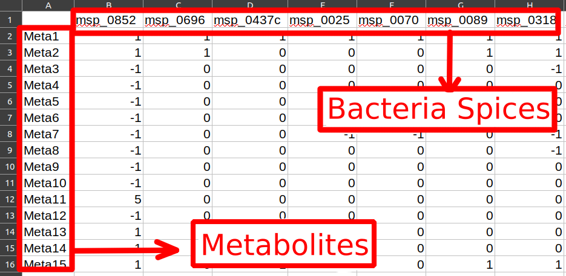
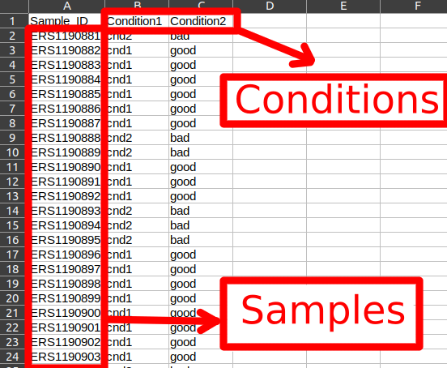
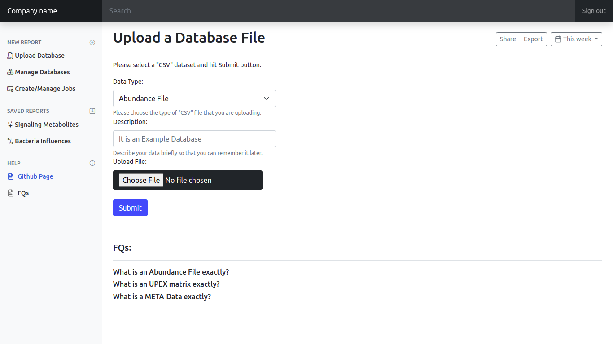
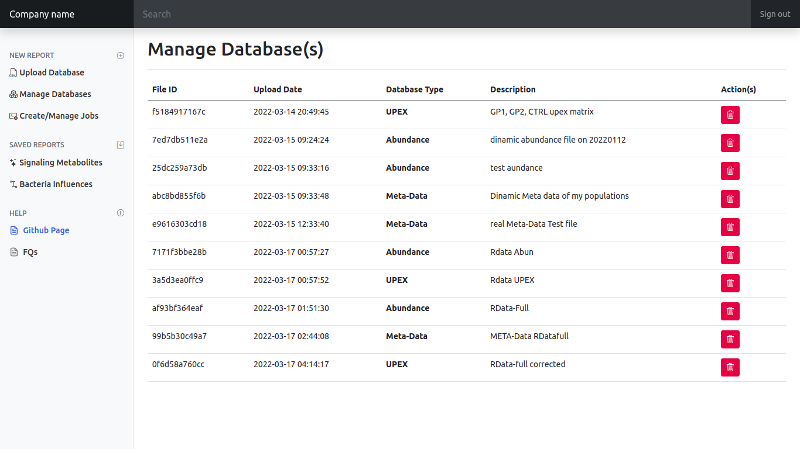
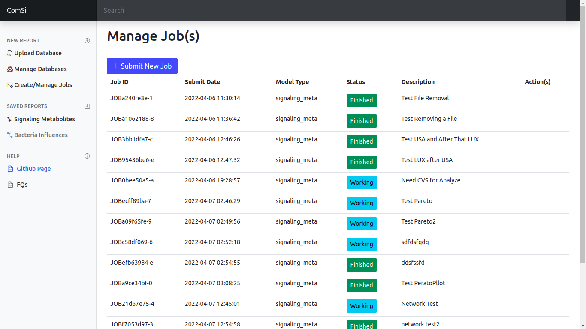
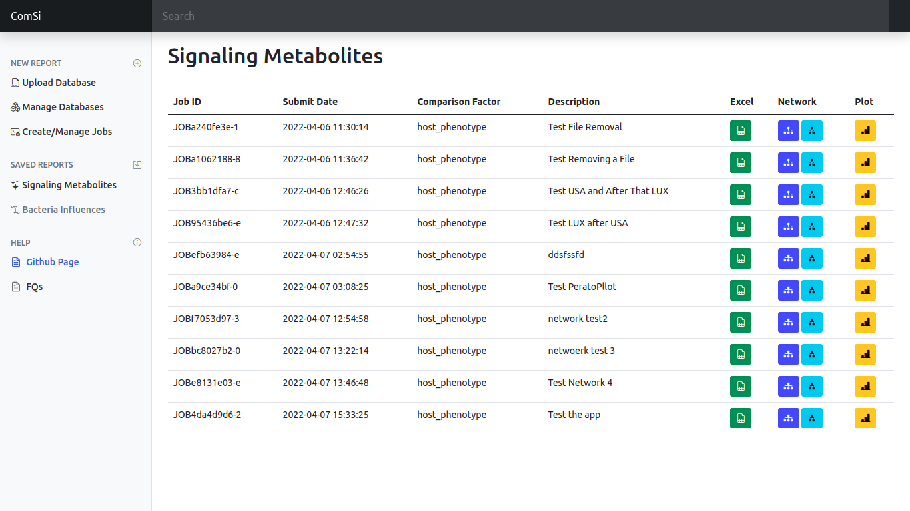
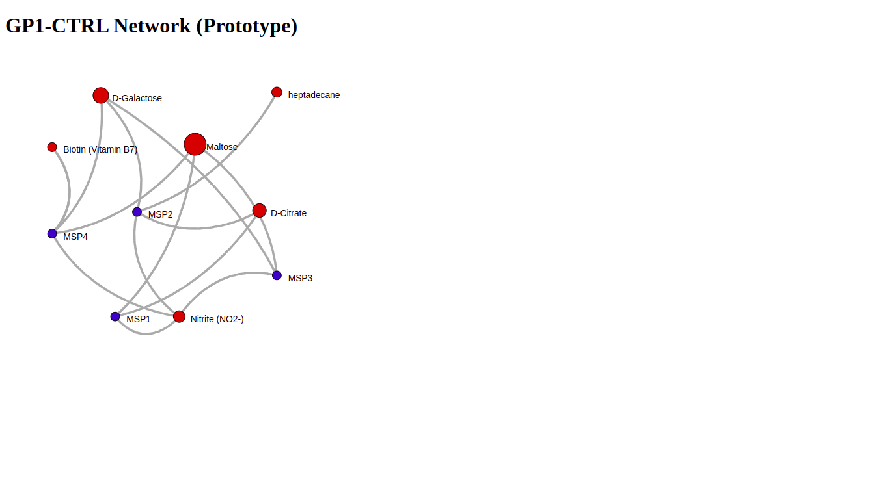

# ComSi - Community Signaling Metabolites Identifier


An application to identify Signaling Metabolites based on the Gut Bacteria influences on each other based on the paper:

>Patil, Kiran Raosaheb, and Jens Nielsen. "Uncovering transcriptional regulation of metabolism by using metabolic network topology." Proceedings of the national academy of sciences 102.8 (2005): 2685-2689.

[link to paper](https://www.pnas.org/doi/abs/10.1073/pnas.0406811102)

## How to Install
There are two ways to install ComSi. First, The easy but isolated method using Docker. Second, The complex but storageable using Anaconda. Each method is explained in details below:

### Installation 1 : Docker (Easy but Isolated)
 Docker creates an isolated environment so that any app can change by its needs. Installing any code using Docker is usually without any special challenge. This repository is also uploaded to Docker-Hub (official Docker server) for easier access.

__Advantages:__
* Easy to install : After installing Docker on your system, the app will run just using one single line of code.

__Disadvantages:__
* Isolated : Each time after using the app, every change and every information you entered will be removed and it will reset-factory the app for the next time.

#### Step1: Installing Docker
The first step is to install Docker based on your OS (Windows, Linux or Mac). Docker is well-known among developers and the installation instructions are simple. The best place to find installation links and tips is Docker official website.

[Install Docker](https://docs.docker.com/get-docker/)

#### Step2: Installing ComSi
After installing Docker just open CMD (in Windows) or Terminal (in Linux or Mac) and run the code below:
```
docker run -p 5000:5000 armin3731/comsi
```
It will automatically download every requirements and install ComSi.

### Installation 2 : Anaconda (Challenging but Storageable)
Anaconda is a great environment for handling python codes. Although installation might seems a bit challenging, but edit codes and save every change and result for later access is much easier using Anaconda.

__Advantages:__
* Storageable : Every result and plot will be saved on your system and you can reach them when every they are needed.
* Easy to Edit : If editing the codes is your purpose, you have to install it this way (Don't think about Docker!)

__Disadvantages:__
* Challenging to Install : The steps might confuse someone who is using Anaconda for the first time but if you have a prior knowledge about Anaconda you will be fine.

#### Step1: Installing Anaconda
Installing Anaconda is explained in their official website which you can find here:

[Install Anaconda](https://docs.anaconda.com/anaconda/install/index.html)

__Note__: ComSi uses python3, therefore install the latest version of Anaconda3 (Anaconda2 is not capable of running python3 codes)
#### Step2: Create New Environment
After you have installed Anaconda3, create an Anaconda environment is the first step:
```
conda create --name comsi python=3.8
```
following the installation, activating environment is the next thing to do:
```
conda activate comsi
```
__Note:__ `comsi` is the name of your environment. If you use a different name while creating it, use that name to activate the environment.
#### Step3: Requirements
Download this repository and run the code below while you are inside the repo-folder:
```
pip install -r requirements.txt
```

## How to Run
Because there are two way of installing this application (Docker and Anaconda), running it differs for each way.
#### Docker
Open the CMD (or Terminal) and run the code below:
```
docker run -p 5000:5000 armin3731/comsi
```
This will initiate a local web-server that you can run in browser under this address:
```
http://localhost:5000/
```

#### Anaconda
 Inside repo-folder (in your system), activate Anaconda environment:
 ```
 conda activate comsi
 ```
 And then:
 ```
 python app.py
 ```
Next, you can use the app inside your browser at:
 ```
http://localhost:5000/
```
## How to Use
This application is a user-friendly web-app to upload databases, identify Signaling Metabolites and present metabolic networks. In brief, first of all, the user uploads databases that represent relation of Bacteria Spices with different Metabolites and Conditions. Then, identifying Signaling Metabolites can start as a new job process. During the calculations,user can add new processes for different Conditions. After each process is done, the results show up so that user can interact and download final outputs.

#### Step0: Database
Signaling Metabolites are identified by interactions of Different Bacteria Spices and Metabolites. Three type of data (__Abundance__, __UPEX__ and __META-DATA__) are needed for the process.

##### - Abundance Data
Abundance Data is a matrix which presents the abundance value of every Bacteria in each research Sample. In other words, how many populated is every Sample by each Bacteria.

Your Abundance database must follow a certain order.
- Your database should be in `CSV` format
- Each _*Row*_ represents a _*Bacteria Spice*_
- Each _*Column*_ represents a _*Sample*_



There is `Example Abundance` already uploaded in the app for a better demonstration. The values in the Data are mostly random generated.

##### - UPEX Data
UPEX Data is a matrix which presents Bacteria Spices and their Metabolites i.e. UPEX specify if a Bacteria produce, consume or ignore a Metabolite.


Your Abundance database must follow a certain order.
- Your database should be in `CSV` format
- Each _*Row*_ represents a _*Metabolite*_
- Each _*Column*_ represents a _*Bacteria Spice*_
- If Bacteria1 __Produces__ Metabolite1 then _UPEX(1,1)=_ __1__
- If Bacteria1 __Consumes__ Metabolite1 then _UPEX(1,1)=_ __-1__
- If Bacteria1 __Ignores__ Metabolite1 then _UPEX(1,1)=_ __0__



There is `Example UPEX` already uploaded in the app for a better demonstration. The values in the Data are mostly random generated.

##### - Meta-Data
Meta-Data is a matrix which presents the specifiaction and conditions of each research Sample.

Your Abundance database must follow a certain order.
- Your database should be in `CSV` format
- Each _*Row*_ represents a _*Sample*_
- Each _*Column*_ represents a _*Condition*_



There is `Example Meta-Data` already uploaded in the app for a better demonstration. The values in the Data are mostly random generated.

#### Step1: Upload Database
In order to upload a new database the `Upload Database` button.



It will lead you to another page where you can choose your desired data base. After choosing your data base, specify the type of database by choosing Abundance, UPEX or Meta-Data. It is strongly recommended to write a Description for each file because ComSi stores each database by an ID and without a description it will be hard to find later. Next, hit `Submit` button to start uploading process.

#### Step2: Create a Job
When uploading is done, you will be directed to `Manage Databases` page. Here, delete or download each database is possible.


In order to find Signaling Metabolites for a Condition, a new job must be created.


In `Create/Manage Jobs` page click on `Submit New Job` button. A massage box pops up and each database for Abundance, UPEX and MetaData should be selected. Based on the database chosen as MetaData some parameters should be defined as below:
- __Description:__ A brief explanation about the process for a better clearity and easier remembrance of conditions.
- __Comparison Factor:__ A Condition in the Samples that is under investigation and research. As an example, a Meta-Data classify Samples by their _*Gender*_ (Male or Female), by their _*Age*_ (Young or Old) and by their _*Geography*_ (USA, UK, SWE). Since identifying Signaling Metabolites is a comparative process, if the user choose "_*Gender*_" as Comparison Factor the final Signaling Metabolite will be calculate for "_*Male_Female*_" situation. On the other hand, if the user choose "_*Geography*_" as Comparison Factor, ComSi will calculate Signaling Metabolites for every combinations i.e. "_*USA_UK*_", "_*USA_SWE*_" and "_*UK_SWE*_".
- __Filter Data:__ User can filter Samples by different Conditions. As an example, in previous example MetaData, if the user choose "_*Gender*_" filter to be "_*Old*_", in the calculation of Signaling Metabolites, only Old Samples will be considered.

Next, hit `Submit` button to start identifying Signaling Metabolites.

#### Step2: Results
After creating new Job, in `Create/Manage Jobs` page it will be shown. When status is `Finished` you can find results in `Signaling Metabolites` page.
For each successful Job there are Excel output file, Network Representation and Paretoplot for top 85 percentile Signaling Metabolites.





